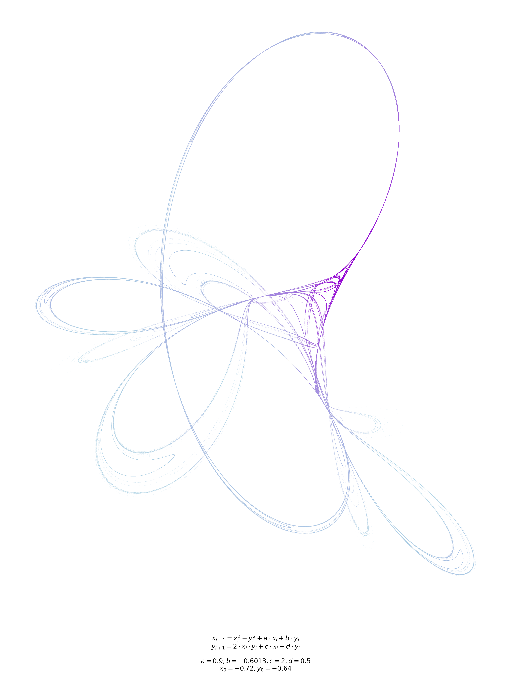

# Chaotic Attractors: Computational Exploration & Visualization

A Python framework for discovering and visualizing 4-parameter chaotic dynamical systems through algorithmic parameter space exploration and statistical quality filtering.

[](https://www.python.org/downloads/)
[](LICENSE)

---

## Gallery

<p align="center">
  
  
  
</p>


**From left to right:** Tinkerbell, Custom2, and Custom3
| Name | Equation | Parameters | Initial Position |
|-----------|-------------|---------------|-------|
| **Tinkerbell** | $x_{n+1}=x_n^2-y_n^2+ax_n + by_n$<br>$y_{n+1}=2x_ny_n+cx_n+dy_n$ | $a=0.9$, $b=-0.6013$, $c=2.0$, $d=0.5$ | $x_0=-0.72$, $y_0=-0.64$ |
| **Custom2**    | $x_{n+1}=a(e^{\cos{x_n}}-\frac{\pi}{2})+b(e^{\sin{y_n}}-\frac{\pi}{2})$<br>$x_{n+1}=c(e^{\cos{x_n}}-\frac{\pi}{2})+d(e^{\sin{y_n}}-\frac{\pi}{2})$ | $a=0.73$, $b=-2.6$, $c=2.31$, $d=1.65$ | $x_0=0$, $y_0=0$ |
| **Custom3**    | $x_{n+1}=ae^{\mathrm{arcsinh}(x_n)}-be^{\sin(y_n)}$<br>$y_{n+1}=ce^{\mathrm{arcsinh}(y_n)}-de^{\sin(x_n)}$ | $a=-2.17$, $b=-2.7$, $c=-2.08$, $d=-2.83$ | $x_0=0$, $y_0=0$ |

---

## Overview

This project implements a computational pipeline for discovering, filtering, and visualizing chaotic attractors&mdash;complex fractal structures that emerge from deterministic iterative systems. The library includes 9 equation systems: 5 classical attractors (Clifford, Tinkerbell, Fractal Dream, Peter de Jong, Johnny Svensson) and 4 custom-designed variants.

**Key Features:**
- Two operational modes: targeted generation and automated discovery
- Production-quality codebase with 50+ unit tests and comprehensive documentation
- High-performance vectorized computation with NumPy
- Publication-ready visualizations with density-based coloring
- Extensible architecture for adding new dynamical systems

---

## Mathematical Background

Chaotic attractors are generated through discrete-time dynamical systems:

$$x_{n+1} = f(x_n, y_n, a, b, c, d)$$

$$y_{n+1} = g(x_n, y_n, a, b, c, d)$$

where $(x_0, y_0)$ are initial conditions and $(a, b, c, d)$ are system parameters. Small changes in parameters can produce dramatically different attractor structures, making systematic exploration challenging.

---

## Modes

### Generate Mode

Create specific attractors from known parameters with high-quality visualization.

**Features:**
- Vectorized NumPy computation generating 2M+ iterations
- Gaussian KDE density estimation on 50K subsamples for structure-revealing coloring
- NaN/Inf filtering with early termination for numerical stability
- Multi-format export (PNG, PDF, SVG) with equation annotation panels
- Customizable colormaps, point sizing, and transparency

**Use cases:** Reproducing known attractors, exploring parameter variations, creating publication figures

---

### Search Mode

Discover novel attractors through automated exploration of parameter space.

**Algorithm:**
1. **Sampling**: Draw parameters uniformly from discrete grid (e.g., range [-3, 3] with 0.01 precision $\rightarrow$ 601 values per parameter $\rightarrow$ $601^4$ $\approx$ 130 billion total combinations)
2. **Quick evaluation**: Generate 25K test points for rapid filtering
3. **Multi-stage filtering**:
   - **Divergence check**: Reject if range > 500 units (divergent behavior)
   - **Collapse check**: Reject if range < 0.25 units (collapsed behavior)  
   - **Aspect ratio filter**: Reject if dimensions differ by >4× (overly elongated)
   - **Uniqueness filter**: Reject if unique point ratio outside [0.1, 0.95] (too periodic or too dispersed)
4. **Full generation**: Regenerate accepted candidates at 2M points
5. **Re-validation**: Apply filters to full-resolution data (some candidates fail at higher resolution)
6. **Scoring and ranking**: Compute composite quality metric
7. **Export**: Save visualizations and CSV parameter summary

**Quality Scoring System:**

Attractors are ranked by normalized squared deviation from ideal aesthetic characteristics:

$$\text{score} = \left(\frac{r_{\text{aspect}} - r_{\text{ideal,aspect}}}{\max(|r_{\text{min}} - r_{\text{ideal,aspect}}|, |r_{\text{max}} - r_{\text{ideal,aspect}}|)}\right)^2 + \left(\frac{r_{\text{unique}} - r_{\text{ideal,unique}}}{\max(|r_{\text{min}} - r_{\text{ideal,unique}}|, |r_{\text{max}} - r_{\text{ideal,unique}}|)}\right)^2$$

**Parameters:**
- $r_{\text{aspect}}$ = aspect ratio (longer dimension ÷ shorter dimension)
- $r_{\text{unique}}$ = fraction of unique points at 2 decimal precision
- $r_{\text{ideal,aspect}} = 1.5$ (slightly rectangular for visual balance)
- $r_{\text{ideal,unique}} \approx 0.67$ (balanced structure and complexity)
- Acceptable ranges: aspect $\in [1.0, 4.0]$, unique $\in [0.02, 0.98]$

**Interpretation:**
- **Score = 0**: Perfect match to ideal characteristics
- **Score ≤ 0.5**: High quality attractor
- **Score range**: [0, 2] where 2 indicates both metrics at worst acceptable extremes

The normalization ensures symmetric penalization—deviations above or below the ideal contribute equally. This is equivalent to the squared Euclidean distance in normalized parameter space.

**Use cases:** Discovering new attractors, building galleries, parameter sensitivity studies

---

## Installation & Setup

```bash
# Clone repository
git clone https://github.com/alexspigler/chaotic-attractors.git
cd chaotic-attractors

# Install package with dependencies
pip install -e .

# Or install with development tools (recommended for contributors)
pip install -e ".[dev]"

# Verify installation by running tests
pytest
```

**Requirements:**
- Python 3.8+
- NumPy, SciPy, Matplotlib (installed automatically)
- pytest, pytest-cov (included with `[dev]` installation)

---

## Usage Examples

### Python API

#### Generate Mode
```python
from chaotic_attractors import prepare_generate_data, save_attractor

# Define parameters
params = {'a': 0.9, 'b': -0.6013, 'c': 2, 'd': 0.5}
x_start = -0.72
y_start = -0.64

# Generate attractor data
data = prepare_generate_data(
    params=params,
    equation_id='Tinkerbell',
    test_iterations=25_000,
    final_iterations=2_000_000,
    x_start=x_start,
    y_start=y_start
)

# Save visualization
save_attractor(
    data=data,
    x_start=x_start,
    y_start=y_start,
    save_format='png',               # Format: 'png', 'pdf', 'svg', or 'all'
    include_info=True,               # Include equation panel
    output_dir='output',
)
```

#### Search Mode
```python
from chaotic_attractors import search_attractors

# Discover attractors with custom parameters
search_attractors(
    equation_id='Custom1',
    x_start=0.5,
    y_start=0.5,
    num_to_find=10,                    # Target number of attractors
    max_attempts=50_000,               # Maximum parameter sets to test
    decimals=2,                        # Parameter precision (2=0.01 step size)
    parameter_ranges={                 # Search bounds for each parameter
        'a': (-3.0, 3.0),
        'b': (-3.0, 3.0),
        'c': (-3.0, 3.0),
        'd': (-3.0, 3.0)
    },
    test_iterations=25_000,
    final_iterations=2_000_000,
    start_counter=1,                   # Filename starting number
    save_format='png',
    include_info=True,
    output_dir='output'
)
```

---

### Command-Line Interface

#### Generate Mode
```bash
python -m chaotic_attractors \
    --equation Custom3 \
    --a -2.17 --b -2.7 --c -2.08 --d -2.83 \
    --x-start 0.0 \
    --y-start 0.0 \
    --test-iter 25_000 \
    --final-iter 2000000 \
    --format png \
    --output-dir output \
    --info-panel
```

#### Search Mode
```bash
python -m chaotic_attractors \
    --mode search \
    --equation Custom3 \
    --range-min -3 \
    --range-max 3 \
    --x-start 0.5 \
    --y-start 0.5 \
    --decimals 2 \
    --num-to-find 10 \
    --max-attempts 50000 \
    --test-iter 10000 \
    --final-iter 2000000 \
    --format png \
    --output-dir output \
    --info-panel
```

---

## Project Architecture

```
chaotic-attractors/
├── chaotic_attractors/          # Main package
│   ├── __init__.py              # Public API exports
│   ├── __main__.py              # CLI interface with argparse
│   ├── core.py                  # Generation, KDE, visualization
│   ├── equations.py             # System definitions (9 attractors)
│   └── search.py                # Stochastic search & filtering
├── tests/                       # Comprehensive test suite
│   ├── test_core.py             # Core generation logic
│   ├── test_equations.py        # Equation compilation
│   └── test_search.py           # Parameter search & scoring
├── images/                      # Example outputs
├── .gitignore                   # Version control exclusions
├── LICENSE                      # MIT License
├── pytest.ini                   # Test runner configuration
├── pyproject.toml               # Package metadata and build config
└── README.md                    # Project documentation
```

### Module Responsibilities

**`core.py`**: Numerical computation and rendering
- Runtime equation compilation with restricted `eval` namespace
- Vectorized trajectory generation with pre-allocated arrays
- NaN/Inf filtering with early termination
- Gaussian KDE on 50K subsamples for density estimation
- Custom colormap construction
- Multi-format export with LaTeX equation rendering

**`search.py`**: Parameter space exploration
- Discrete uniform sampling with configurable precision
- Multi-criteria evaluation function
- Composite quality scoring
- Automated file management and CSV logging
- Progress tracking with timing statistics

**`equations.py`**: System library
- String-based equation definitions for runtime compilation
- Easy addition of new attractors (just add to dictionary)

---

## Testing & Validation

50+ unit tests across 3 modules ensuring code quality and correctness:

* `test_core.py`: Generation, KDE, visualization, LaTeX conversion
* `test_equations.py`: All 9 systems validated with parametrized tests
* `test_search.py`: Random sampling, evaluation, scoring, edge cases

```bash
# Run full test suite with coverage
pytest

# View detailed coverage report
open htmlcov/index.html
```

Test configuration in `pyproject.toml` automatically enables verbose output, coverage measurement, and HTML report generation.

---

## License

MIT License - see [LICENSE](LICENSE) file for details.