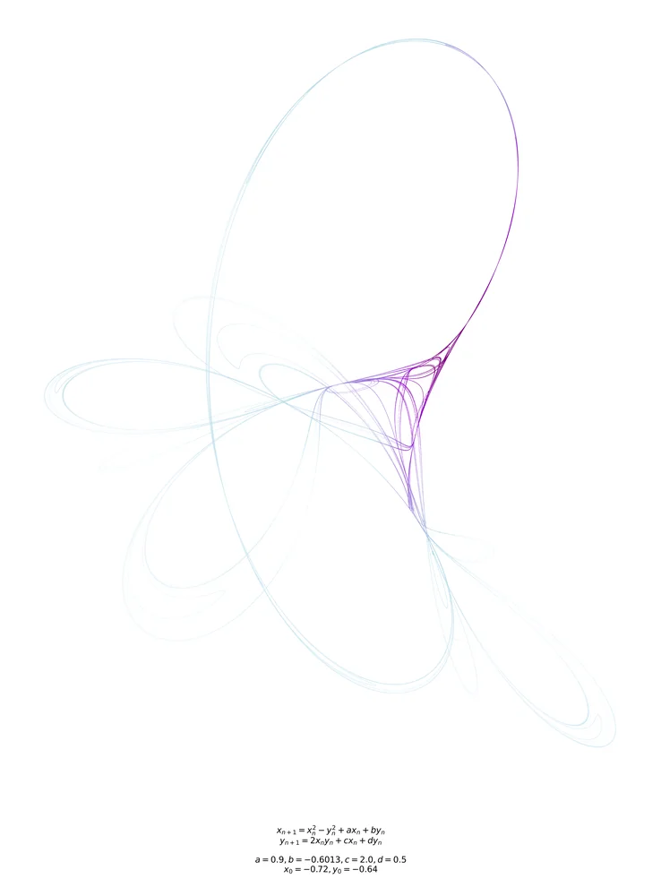
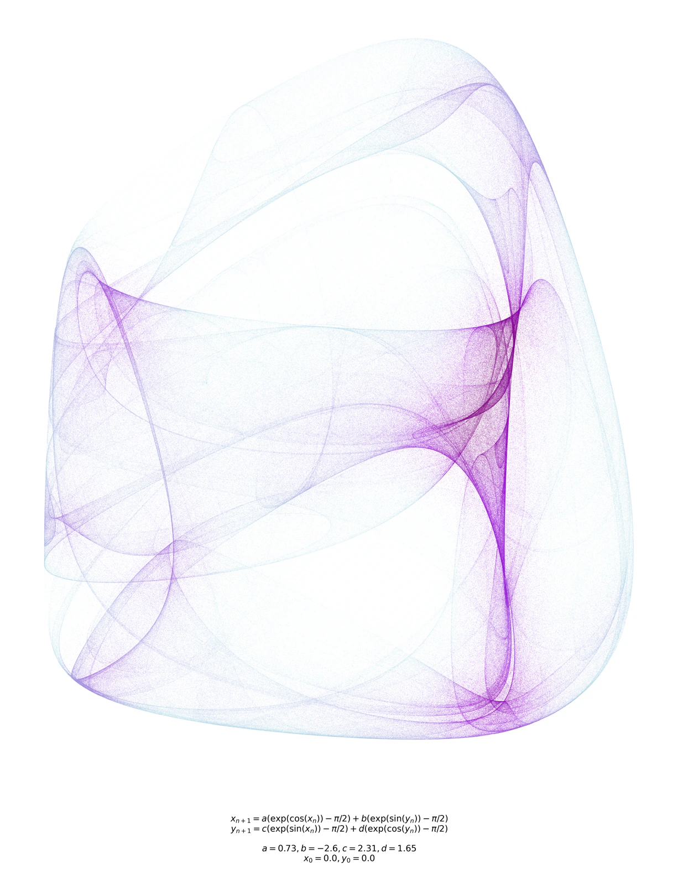
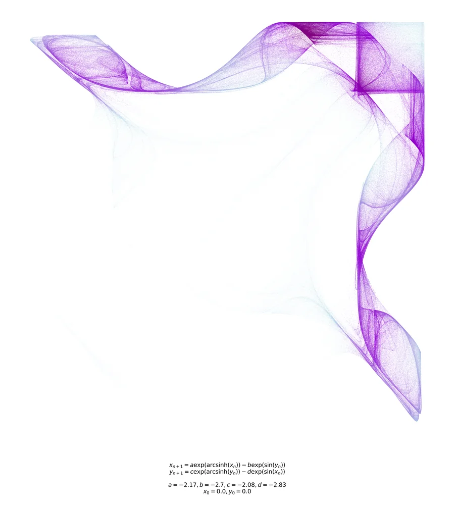

# Chaotic Attractors: Computational Exploration & Visualization

A Python package for searching, validating, and visualizing four-parameter
discrete dynamical systems.

## Gallery

<p align="center">
  <a href="images/Tinkerbell_full.webp"></a>
  <a href="images/Custom2_full.webp"></a>
  <a href="images/Custom3_full.webp"></a>
</p>

| Name | Equation | Parameters | Initial position |
| --- | --- | --- | --- |
| **Tinkerbell** | $x_{n+1}=x_n^2-y_n^2+ax_n+by_n$<br>$y_{n+1}=2x_ny_n+cx_n+dy_n$ | $a=0.9$, $b=-0.6013$, $c=2.0$, $d=0.5$ | $x_0=-0.72$, $y_0=-0.64$ |
| **Custom2** | $x_{n+1}=a(e^{\cos(x_n)}-\frac{\pi}{2})+b(e^{\sin(y_n)}-\frac{\pi}{2})$<br>$y_{n+1}=c(e^{\sin(x_n)}-\frac{\pi}{2})+d(e^{\cos(y_n)}-\frac{\pi}{2})$ | $a=0.73$, $b=-2.6$, $c=2.31$, $d=1.65$ | $x_0=0$, $y_0=0$ |
| **Custom3** | $x_{n+1}=ae^{\operatorname{arcsinh}(x_n)}-be^{\sin(y_n)}$<br>$y_{n+1}=ce^{\operatorname{arcsinh}(y_n)}-de^{\sin(x_n)}$ | $a=-2.17$, $b=-2.7$, $c=-2.08$, $d=-2.83$ | $x_0=0$, $y_0=0$ |

The package includes nine equation systems: five established attractor forms and
four experimental variants. Tinkerbell, Custom2, and Custom3 use the initial
positions shown above when generated from the command line.

## What the package does

- Generates a specified system from known parameters.
- Searches a decimal parameter grid with a reproducible random seed.
- Uses a short trajectory to reject divergent, collapsed, or severely elongated
  candidates before running the full simulation.
- Discards an initial burn-in period and checks the full trajectory for point
  recurrence, geometry, and a positive finite-time largest Lyapunov estimate.
- Colors points with a Gaussian KDE fitted to a random subsample.
- Exports PNG, PDF, or SVG files, with an optional equation panel and CSV summary.

A positive finite-time Lyapunov estimate is numerical evidence of sensitive
dependence for the simulated trajectory. It is not a proof that a system is
chaotic for every initial condition or parameter perturbation.

## Search pipeline

For each parameter draw, search mode runs the following steps:

1. Sample $a$, $b$, $c$, and $d$ uniformly from the requested decimal grid.
2. Generate a short trajectory after discarding the burn-in period.
3. Reject early termination, small or excessive ranges, and aspect ratios above
   the configured limit.
4. Regenerate survivors at full length.
5. Recheck geometry, calculate the rounded unique-point ratio, and estimate the
   largest Lyapunov exponent by propagating a tangent vector through
   finite-difference Jacobians.
6. Rank accepted candidates by the squared normalized distance from the target
   aspect and unique-point ratios.
7. Save the plot and record the parameters, diagnostics, burn-in, and seed in a
   CSV file.

The reported aspect ratio is always the longer range divided by the shorter
range, so it is never below 1. Search skips duplicate parameter draws within a
run. Existing output files are protected unless `--overwrite` is supplied.

The default search can be a long computation: up to 20,000 short trajectories
of 100,000 retained points each, followed by two-million-point simulations for
survivors. Use smaller limits while testing a new equation or configuration.

### Ranking score

The Lyapunov estimate is a pass/fail diagnostic. Accepted candidates are ranked
separately using aspect ratio and unique-point ratio:

$$
\text{score} =
\left(\frac{r_{\text{aspect}}-1.5}{\max(|1-1.5|,|4-1.5|)}\right)^2 +
\left(\frac{r_{\text{unique}}-2/3}{\max(|0.25-2/3|,|1-2/3|)}\right)^2.
$$

Lower scores are closer to the two target values. The score is an aesthetic
ranking rule, not a measure of the strength of chaos.

## Installation

```bash
git clone https://github.com/alexspigler/chaotic-attractors.git
cd chaotic-attractors

python3 -m venv .venv
source .venv/bin/activate  # Windows: .venv\Scripts\activate
python -m pip install .
```

For development:

```bash
python -m pip install -e ".[dev]"
pytest
```

The package supports Python 3.10 and later.

## Command-line examples

Generate the built-in Tinkerbell example. Its parameters and nonzero initial
position are used automatically:

```bash
chaotic-attractors --equation Tinkerbell --seed 42
```

Generate Custom3 from explicit parameters:

```bash
chaotic-attractors \
  --equation Custom3 \
  --a -2.17 --b -2.7 --c -2.08 --d -2.83 \
  --x-start 0 --y-start 0 \
  --format all \
  --seed 42
```

Search Custom1 over $[-3,3]$ in increments of 0.01:

```bash
chaotic-attractors \
  --mode search \
  --equation Custom1 \
  --range-min -3 --range-max 3 \
  --decimals 2 \
  --num-to-find 10 \
  --max-attempts 50000 \
  --seed 42 \
  --output-dir output
```

PDF and SVG exports rasterize the point cloud by default while retaining the
container and text as vector content. This keeps multi-million-point files from
becoming impractically large. Pass `--vector-points` when every point must remain
a vector element.

Run `chaotic-attractors --help` for all controls, including burn-in length,
Lyapunov iterations, KDE sample size, and overwrite behavior.

## Python API

```python
from chaotic_attractors import prepare_generate_data, save_attractor

params = {"a": 0.9, "b": -0.6013, "c": 2.0, "d": 0.5}
data = prepare_generate_data(
    params=params,
    equation_id="Tinkerbell",
    x_start=-0.72,
    y_start=-0.64,
    test_iterations=100_000,
    final_iterations=2_000_000,
    burn_in=1_000,
    seed=42,
)

save_attractor(
    data=data,
    x_start=-0.72,
    y_start=-0.64,
    output_dir="output",
    save_format="png",
    include_info=True,
)
```

The effective random seed is stored in the returned data. Search mode also
writes it to the summary CSV, allowing a run to be repeated when no seed was
specified initially.

## Project structure

```text
chaotic-attractors/
├── chaotic_attractors/
│   ├── __main__.py      # command-line interface
│   ├── core.py          # trajectory generation, density, and plotting
│   ├── equations.py     # equation definitions
│   ├── metrics.py       # finite-time Lyapunov estimate
│   └── search.py        # sampling, validation, ranking, and logging
├── tests/
├── images/
├── pyproject.toml
└── README.md
```

The test suite covers the public workflows, numerical diagnostics, command-line
argument handling, reproducibility, export behavior, and equation definitions.
Continuous integration runs linting, formatting checks, and tests on Python
3.10, 3.12, and 3.14 with an 80% coverage floor.

## Author

**Alex Spigler** — Statistics & Computer Science, George Washington University  
[LinkedIn](https://linkedin.com/in/alexspigler) · [alexspigler.dev](https://alexspigler.dev)

## License

MIT License. See [LICENSE](LICENSE).
